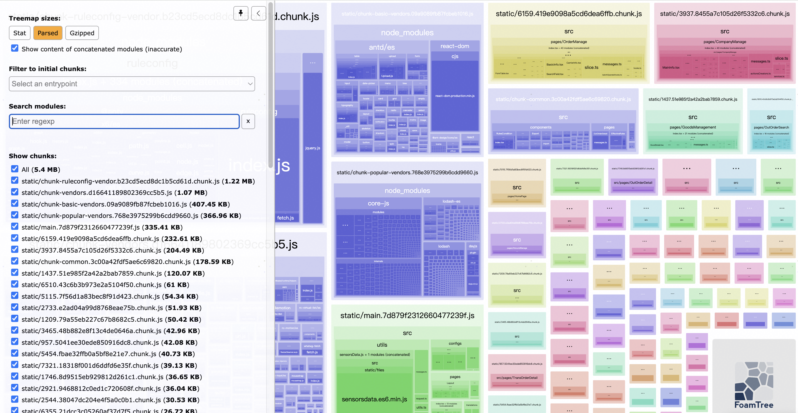

大概 23 年的 5 月份，在测试环境验需求的时候发现：停用缓存的情况下，首页刷新加载一次耗时非常高，大约要 30s，非常夸张的时间了。看了一下网络请求，发现问题出在一个体积较大的 js 文件上（gzip 压缩后 1.6M，未压缩为 4.7M），单加载这个文件就用掉了 23s 左右的时间。这就有点奇怪了，1.6M 的文件，下载要 23s，不合理呀🤔。然后在同事电脑上试了一下，发现相比之下，要比我自己的电脑上好不少。好吧，办公网针对我😡。

虽说我这里加载耗时高是网络抽风的问题，但是项目打包的产物中确实存在体积过大的 js 文件，说明项目现在的 Webpack 打包配置存在不太合理的地方。正好当时在深入学习 Webpack 配置和优化，拿项目来验证一下学习成果，岂不美哉（王司徒.jpg😎）。开搞🚀～～～

# 抽离配置文件

项目的搭建用了内部沉淀的一个中后台集成框架，整体的开发体验还是不错的，但是对于 Webpack、Babel 等编译构建的配置封装的不太好：提供了一个开箱即用的基础 Webpack 配置，但没有释放这些配置文件而是封装成了一个单独的包。虽然提供了用来覆盖默认配置的方法，但仔细盘查梳理之后发现存在一些问题：有些自定义的配置项没有按照预期覆盖掉默认的配置项；`webpack-bundle-analyzer` 没办法正常启动等。没办法，只能抛弃这个包，把现在的配置抽离出来，然后再进行分析优化了。

经过一顿 CV、合并之后，项目使用的编译打包配置单独抽了出来，目录和文件结构如下：

```shell
webpack
├── babelConfig.js
├── babelDepConfig.js
├── terserOptions.js
├── webpack.base.js
├── webpack.dev.js
└── webpack.prod.js
```

之前的包中，没有用到 `webpack-dev-server`，而是一个自己实现的开发服务器。抽离出来之后，切回了 `webpack-dev-server`。

# Webpack、Babel 升级

项目使用的是 Webpack4，为了能够利用 Webpack5 的缓存系统特性来提升开发环境的编译速度，所以选择了升级，同时也顺便升级了一下 Babel 相关的包。

升级的过程相对比较顺利，其中有几个点需要注意：

- Webpack5 内置了对资源模块（图片、字体、media 等）的解析和处理，所以 4 中常用的 `raw-loader`、`url-loader`、`file-loader` 已经不再需要了。这里的配置项需要进行更改，具体可以参考 [Webpack 中文文档](https://www.webpackjs.com/guides/asset-modules/)
- Babel 升级到 v7.18 之后，`@babel/preset-env` 已经可以支持 `async/await/generator` 的降级编译了。如果项目中采用的是 `usage: 'entry'` 的策略，可以在入口文件中放心地删除引入语句 `import 'regenerator-runtime/runtime'` 了
- 升级之后启动项目可能会失败，出现类似 `Module not found: Error: Package path ./helpers/esm/regeneratorRuntime is not exported from package @ant-design\pro-layout\node_modules@babel\runtime (see exports field in \node_modules@ant-design\pro-layout\node_modules@babel\runtime\package.json)` 的编译错误。这是由于 `@ant-design/pro-layout` 所依赖的 `@babel/runtime` 版本低于 v7.18，还没有内置 `regeneratorRuntime`。虽然我们项目中已经用了高版本的 `@babel/runtime`，但 `@ant-design/pro-layout` 并没有使用这个版本，所以需要通过 `npm dedupe` 命令更新一下项目的依赖树，让 `@ant-design/pro-layout` 使用高版本的 `@babel/runtime`。其他方法可参考 [issue](https://github.com/ant-design/pro-components/issues/5273)

# 构建产物分析

这里主要用到的工具就是 `webpack-bundle-analyzer` 这个插件了。安装完成后简单配置一下，插件就会在构建完成之后自动启动一个浏览器页面，将我们的构建产物进行一个可视化展示。

## 整体概览


通过上图我们可以看出，最终产出的 js 文件中，有两个体积明显较大：一个 3.07M，一个 4.64M。前者是项目使用的一个名为 rule_config 的包，后者是项目所用到的 node_modules 中剩余包的集合。我们需要进行优化的就是这两个 js 文件，其他的 js 文件都是采用异步加载的页面模块，体积也都正常，无需考虑。

## 存在问题

接下来通过对这个两个大文件的构成分析，大概总结出了以下的几个问题：

- `@ant-design/icons`、`@ant-design/pro-layout` 没有按需引入，而是全量引入。项目中实际上只用了 10 个左右的 icon，`@ant-design/pro-layout` 中也只用了 `WaterMark` 这个组件


- 许多包存在重复引入的问题，没有对这些基础的包进行单独抽离，比如 `lodash`、`jquery`、`@ant-design/icons` 等


- `momentjs` 中存在大量没有用到的本地化文件，项目中国际化只有中文和英文两种，其他的都不需要


- `lodash` 没有按需引入

# 优化方法

针对上面找到的几个问题，其实办法也都比较简单，无非就是正确按需引入、抽离公共包以及去掉无用的本地化问题。大部分问题解决都相对简单，而 `antd`、`@ant-design/icons`、`@ant-design/pro-layout` 按需引入这个地方花了不少时间才解决。接下来我们从易到难，一一了解一下对应的解决方案。

## Lodash 按需引入

我们在使用 `lodash` 的时候，有 3 种方式可以实现按需引入：

- 使用 `import sortBy from 'lodash/sortBy'` 而不是 `import { sortBy, isEqual } from 'lodash'` 或 `import * as lodash from 'lodash'`
- 使用 `lodash-es` 这个包替代 `lodash`，`lodash-es` 原生支持按需引入
- 使用对应的 babel 插件来完成按需引入，比如 `babel-plugin-lodash` 或者 `babel-plugin-import`

项目中很多地方引入 `lodash` 使用的是解构的方式引入的，手动一个一个修改太耗时间，所以采用的是 babel 插件的方式解决，配置如下：

```javascript
// babelConfig.js
module.exports = {
	...
	plugins: [
		[
			resolve.sync('babel-plugin-import'),
			{ libraryName: 'lodash', libraryDirectory: '', camel2DashComponentName: false },
		],
	].filter(Boolean),
};
```

## 抽离公共包，消除重复引入

项目之前将 node_modules 中的所有包（除 rule_config 之外）都放在了一个 chunk 中，这里可以将常用的包进行一个抽离：`react`、`react-dom`、`react-router-dom`、`antd`、`@ant-design/icons` 拆到一个 chunk 中；`lodash`、`core-js`、`moment`、`jquery` 拆到另一个 chunk 中，剩下的则都归到一个 chunk 中。这样，消除了重复引入的问题，也将大体积的 chunk 拆分成了小的 chunk。配置代码如下：

```javascript
splitChunks: {
	...
	cacheGroups: {
		basicVendors: {
			name: `chunk-basic-vendors`,
			test: /[\\/]node_modules[\\/](react|react-dom|react-router-dom|antd|@ant-design\/icons)[\\/]/,
			priority: 0,
			chunks: 'all'
		},
		popularVendors: {
			name: `chunk-popular-vendors`,
			test: /[\\/]node_modules[\\/](lodash|core-js|moment|.+jquery)[\\/]/,
			priority: -10,
			chunks: 'all'
		},
		vendors: {
			name: `chunk-vendors`,
			test: /[\\/]node_modules[\\/]/,
			priority: -20,
			chunks: 'all'
		},
	...
	},
},
```

## 去除 Momemtjs 无用的本地化文件

这里我们可以用 moment 专门的插件来完成这个工作，也可以通过 Webpack 提供的 `IgnorePlugin` 来帮助我们完成这个工作。项目中使用的是 `IgnorePlugin`，配置如下：

```javascript
plugins: [
	...
	// 去掉 moment 中没有用到的本地化文件
	new IgnorePlugin({
		resourceRegExp: /^\.\/locale$/,
		contextRegExp: /moment$/,
	}),
].filter(Boolean)
```

## 组件库按需引入

查阅官方文档可以知道，从 4 版本开始，`antd` 已经支持了 js 文件的按需引入，`@ant-design/icons`、`@ant-design/pro-layout` 同样也支持，使用的时候并不需要做其他额外的配置。但是项目最终打包出来的产物确实没有做到按需引入🤔……一开始以为是 `babel-plugin-import` 配置的不对，经过折腾之后发现并没有什么用。然后查了一些资料，也没有有用的办法。最后发现，其实是 Webpack 配置中的 `resolve` 配置项有点问题。

项目中原来的配置是这样的：

```javascript
module.exports = {
	...
	resolve: {
		...
		mainFields: ['browser', 'jsnext:main', 'main'],
	},
	target: 'web',
}
```

问题就出在 `mainFields` 这个字段，`mainFields` 字段的作用是当从 npm 包中导入模块时，这个选项将决定使用 `package.json` 哪个字段导入模块，有多个值的时候，会从前往后进行查找，直到找到一个可用的为止。以 antd 为例，查看 `antd/package.json` 可以发现，其中设置了 `module`、`main` 两个字段：


绝大多数的库都会提供这两个配置项，`module` 对应的文件是支持 ES Module 的模块语法的，能够很好的进行 Tree Shaking；而 `main` 则对应的是 commonjs 语法的文件；有些库还会提供 `browser` 等字段，用于在其他环境中使用。

不难发现项目中的 `jsnext:main` 配置项有点问题，需要修改成 `module`，其实 Webpack 的 `target` 为 `web` 时，`mainFields` 的默认值就是 `['browser', 'module', 'main']`，所以这里也可以不用设置，直接使用默认值即可。修正这一点之后，这几个包的按需引入就可以正常工作了。

# 优化结果

**优化之后，项目的构建体积相比之前有了大幅的压缩，由原来的 13.5M 减少到 7.45M。同时，所有的 js 文件体积都控制在了 1.5M 以下（未压缩）。优化效果则表现在 Jenkins 打包耗时由原来的 5min 缩短为 3min，首页加载的速度也有一定的提升**。

放一下优化后的构建产物图，可以参照优化前的做一个对比：


# 二次优化

24 年 4 月份，项目做了 dayjs 替换 moment 的优化。在验证优化是否生效的过程中发现：项目打包之后的体积快接近 10M 了！？我直觉上感觉不应该有这么大，虽然接近一年多的时间里有新的需求，体积肯定会有增长，但增加了 2M+，不太合理。经过一番折腾，最终确定是**之前写的拆 chunk 规则有点问题，少加了一个重要的属性： `reuseExistingChunk`**。

`reuseExistingChunk` 选项的作用是决定是否重用已经存在的代码块，具体到我们的项目中，就是在拆 chunk 时，`reuseExistingChunk` 设置为 `true` 会确保优先级低的 chunk 尽可能地共享优先级高的 chunk 中的代码，能够进一步降低打包体积，优化页面加载速度。

找到问题之后，对 splitChunk 配置又进行了一次优化，优化后的配置如下：

```javascript
splitChunks: {
	chunks: 'all',
	minSize: 102400,
	minChunks: 1,
	maxAsyncRequests: 5,
	maxInitialRequests: 6,
	cacheGroups: {
		basicVendors: {
			name: `chunk-basic-vendors`,
			test: /[\\/]node_modules[\\/](react|react-dom|react-router-dom|antd|@ant-design\/icons)[\\/]/,
			priority: 30,
			chunks: 'all',
			reuseExistingChunk: true
		},
		popularVendors: {
			name: `chunk-popular-vendors`,
			test: /[\\/]node_modules[\\/](lodash|core-js|dayjs|lodash-es|moment)[\\/]/,
			priority: 20,
			chunks: 'all',
			reuseExistingChunk: true
		},
		// 只有一个页面用了ruleconfig这个包，其他地方用不到，这个包及其依赖比较大
		// 所以单独拆出来，按需加载不对其他页面造成影响
		ruleconfigVendor: {
			name: `chunk-ruleconfig-vendor`,
			test: /[\\/]node_modules[\\/](ruleconfig|@antv\/x6|@antv\/x6-react-shape|jquery)[\\/]/,
			priority: 10,
			chunks: 'all',
			reuseExistingChunk: true
		},
		vendors: {
			name: `chunk-vendors`,
			test: /[\\/]node_modules[\\/]/,
			priority: 0,
			chunks: 'all',
			reuseExistingChunk: true
		},
		common: {
			name: `chunk-common`,
			minChunks: 2,
			priority: -10,
			chunks: 'all',
			reuseExistingChunk: true,
		},
	},
},
```

通过这次的优化，打包之后的体积降低到了 5.4M。产物可视化图如下：



# 总结

项目优化，其实是一个持续性的工作。在一个阶段有一个较优的解，但随着迭代进行下去，可能需要进行再次优化。这样才可以保持项目的稳定性、性能在一个比较好的水平。

优化是一个有点吃力不讨好的活，可能你的优化并没有带来很明显的感知（除非项目已经到了不优化已经快不能用的阶段了）。但优化的过程，对于提升自己发现问题、分析问题、解决问题的能力非常有帮助。可能有些同学对于项目中这类基础配置的态度是 " 项目能跑就不动 "、" 不敢动 "，其实也没必要。现在借助 GPT 这类 AI 的帮助，我们可以很快的了解一些不太明白的领域或者更加具体的一段代码，再结合官方文档和自己的理解，完成一项较为复杂的优化也是没什么大问题的。大家都可以试一试，实践才有收获嘛，动动手没啥坏处。

OK，碎碎念结束。完活儿！
