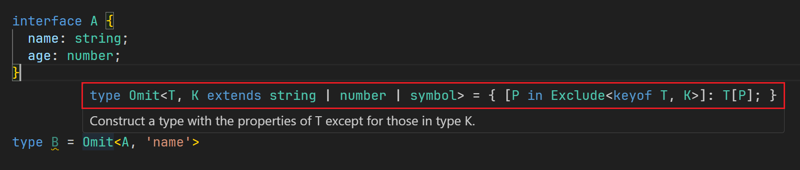

# `as const` 类型断言

`as const` 是 TypeScript 中的一个类型断言，主要有两个作用：

- **将变量的类型提升到『字面量类型』，而不是更泛化的类型**。例如，`const str = 'hello' as const` 其中 `str` 的类型将变成 `'hello'` 而不是 `string`。
- **将变量视为只读，不能再被修改**。这意味着你不能修改数组/元组的元素或长度，不能修改对象的属性的值等。

它**只能用在数组、对象和基本类型（字符串、数字等）的字面量上**，以下是一些示例：

```typescript
// 将一个数组转换为只读的元组，元组元素的类型是它们的字面量类型
// arr 的类型为 readonly [1, 'a', true]
const arr = [1, 'a', true] as const;

// 对象的属性变为只读的，并且属性值的类型是它们的字面量类型
// obj 的类型为 { readonly a: 1, readonly b: '2', readonly c: true }
const obj = { a: 1, b: '2', c: true } as const;

// 变量的类型被提升为具体的字面量类型，而非宽泛的 string、number 等类型
// str 的类型为 'hello'
const str = 'hello' as const;
// num 的类型为 123
const num = 123 as const;
// bool 的类型为 true
const bool = true as const;
```

# 只读数组

两种定义方式：

- **使用 `readonly` 修饰符，只能用在数组、元组的字面量类型上**。例如：`readonly string[]`，不能用在数组泛型类型上。
- **使用 `Readonly` 或者 `ReadonlyArray` 两个泛型**。例如：`Readonly<Array<string>>`、`ReadonlyArray<string>`。

通常理解，只读数组和数组的关系应该是子类和父类的关系，因为只读数组属于数组嘛，但是在 TypeScript 中是不对的。**Typescript 中数组是只读数组的子类型**。这是因为只读数组没有 `pop()`、`push()` 之类会改变原数组的方法，而数组显然是有的。也就是说，数组有只读数组的所有特性，并且还有自己专有的特性（即子类型继承了父类型的所有特征，并加上了自己的特征）。

# 扩展运算符 `…`

在类型定义中，同样可以使用扩展运算符 `…`，用法和在 JavaScript 类似，但是有**一个显著的区别：不能对『对象类型』使用**。

> 这里的对象类型在 Typescript 中并没有，不过我们日常使用最常用的就是使用 `interface`、`type` 给对象定义一个对应的类型，所以这里用这样的描述也比较好理解。

扩展运算符常用于数组、元组、函数参数等场景的类型定义中，例如：

```typescript
type Tuple1 = [1, true];
// Tuple2 的类型为 [1, true, string]
type Tuple2 = [...Tuple1, string];

type Params = [number, string, boolean];
// Func 的类型为 (args_0: number, args_1: string, args_2: boolean) => void
type Func = (...args: Params) => void;

type Arr1 = string[];
// Arr2 的类型为 string[]
type Arr2 = [...Arr1];
// Arr3 的类型为 [...string[], boolean, number]，一个不定长的元组
type Arr3 = [...Arr1, boolean, number];
```

# 类型递归

利用 `extends … ? … : …` 的条件运算符来调用自身，就可以实现类似于递归函数效果的类型递归。例如：

```typescript
// Type Challenges 189题：给定 Promise<ExampleType>，获取 ExampleType 类型
// 这里有一个注意的地方就是：如果 ExampleType 是一个 Promise，那就需要递归来处理
type MyAwaited<T extends PromiseLike<any>> = T extends PromiseLike<infer U> ? U extends PromiseLike<any> ? MyAwaited<U> : U : never;
```

# 条件类型 `extends`

 `extends … ? … : …` 和 JavaScript 中的三元运算很相似，通过判断来获得不同条件下给定的类型。通常来说，`A extends B ? true : false` 中如果 `A` 可以赋值给 `B` （可以理解为 `A` 是 `B` 的子类型），那么结果就是 `true`，反之则是 `false`。例如：

```typescript
type A = string;
type B = string | number;
// IsAString 的类型为 true
type IsAString = A extends string ? true : false;

type C = { name: string; age: number; };
type D = { name: string };
// E 的类型为 true
type E = C extends D ? true : false;
```

> 如何来判断一个类型可以赋值给另一个类型？可以类比与 Java 中的子类与父类，即：**如果类型 A 至少包含了类型 B 的所有属性和方法，那么类型 A 就可以赋值给类型 B**。我一般习惯使用『子类型和父类型』的关系来理解。

但如果 `extends` 左边的类型参数是一个联合类型（即：`Type1 | Type2`），处理逻辑会有些不同：**当 `T extends U ? X : Y` 中的 `T` 是一个联合类型的类型参数时，该条件类型将被分解为多个条件类型的联合（即分布式条件类型规则）**。

> 特别注意：**条件类型的分布式规则只有在条件类型的检查类型（`extends` 左边）位置为类型参数（而非具体的联合类型）时，才会进行分布**。如果在检查类型位置使用一个具体的联合类型，比如 `string | number`，那么这个联合类型就不会被拆解，它会被当作一整个类型来对待。

例如：

```typescript
type A = string | number;
type B = number | boolean;
// 这里的 A 并不是一个类型参数，而是一个具体的联合类型，所以并不会触发分布式规则
// string | number 显然不能赋值给 number | boolean
// 所以 C 的类型为 false
type C = A extends B ? true : false;

type ToArray<T> = T extends any ? T[] : never;
// 这里的条件类型进行处理的时候，如果给定的 T 是一个联合类型，就会触发分布式规则。因为 T 这个类型是泛型 ToArray 的类型参数
// 例如 type Result = ToArray<string | number>
type Result = ToArray<string | number>;
// 使用分布式规则分解一下就是拆分成这样
type Result = ToArray<string> | ToArray<number>;
// 最终的结果就是 Result 的类型为 string[] | number[]
```

常用的工具类型 `Exclude` 就是利用这个规则实现的：

```typescript
type Exclude<T, U> = T extends U ? never : T;
// A 的类型为 'b' | 'c'
type A = Exclude<'a' | 'b' | 'c', 'a'>；
```

如果在条件类型中处理联合类型的类型参数时不想默认的分布式规则生效，可以使用方括号（`[]`）将 `extends` 左右的两个类型包裹一下。例如：

```typescript
type ToArray<T> = [T] extends [any] ? T[] : never;
// 这里用方括号处理了一下，即使给定的 T 是一个联合类型，也不会触发分布式规则
// Result 的类型为 (string | number)[]
type Result = ToArray<string | number>;
```

# `Omit`

这个内建类型并不难实现，也不难理解。这里记录的原因是在 Type Challenges 做题时发现其实编辑器对于 `Omit` 的类型提示是有误导性的。也可以通过 [第3题](https://github.com/type-challenges/type-challenges/tree/main/questions/00003-medium-omit) 和 [第8题](https://github.com/type-challenges/type-challenges/tree/main/questions/00008-medium-readonly-2) 来进行一个验证。

如果你在 VS Code 或者 [TS演练场](https://www.typescriptlang.org/zh/play) 中查看 `Omit` 的类型提示，会得到如下的结果：  
  
自然的，在自己实现 `Omit` 时，就会使用这种写法，在 Type Challenges 的第 3 题确实可以通过给出的 case。但是在第 8 题中，你会发现使用 `Omit` 可以通过给出的所有 case，但是如果用上面的实现方式替换 `Omit`，就会有部分 case 不通过。这两个不是完全一样的东西吗！？

其实并不是一样的，如果你查看 [源码](https://github.com/microsoft/TypeScript/blob/main/src/lib/es5.d.ts) 就会看到 `Omit` 的实现并不是编辑器给出的类型提示那样，而是：`type Omit<T, K extends keyof any> = Pick<T, Exclude<keyof T, K>>`。区别可以通过第 8 题的给出的例子类型来说明：

```typescript
interface Todo2 {
  readonly title: string;
  description?: string;
  completed: boolean;
}
// 根据编辑器的提示实现的 Omit
type MyOmit<T, K> = {
  [P in Exclude<keyof T, K>]: T[P];
}

type A = Omit<Todo2, 'description'>;
const a: A = { title: '123', completed: true };
// 修改 title 属性这里会报错：只读属性不可以赋值
a.title = 'title'; 

type B = MyOmit<Todo2, 'description'>;
const b: B = { title: '123', completed: true };
// 这里修改就是可以的
b.title = 'title'; 
```

确实是有差异的，通过编辑器的类型提示也可以看出来：

https://www.typescriptlang.org/docs/handbook/2/mapped-types.html#key-remapping-via-as  
https://github.com/microsoft/TypeScript/issues/39802
